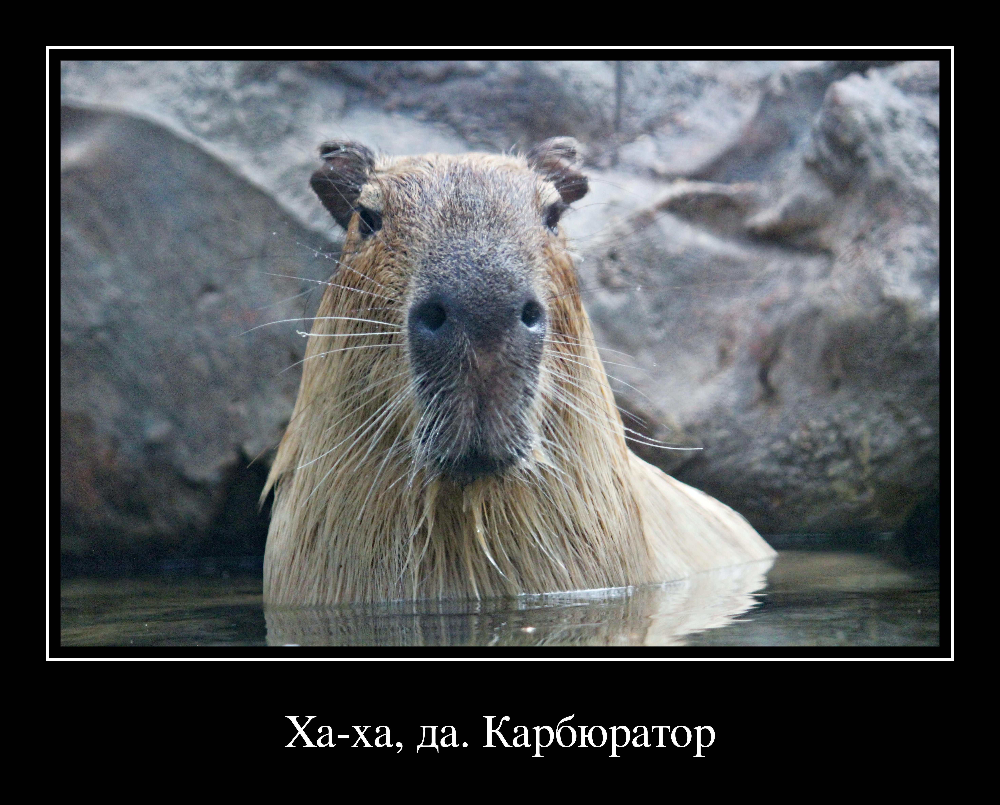
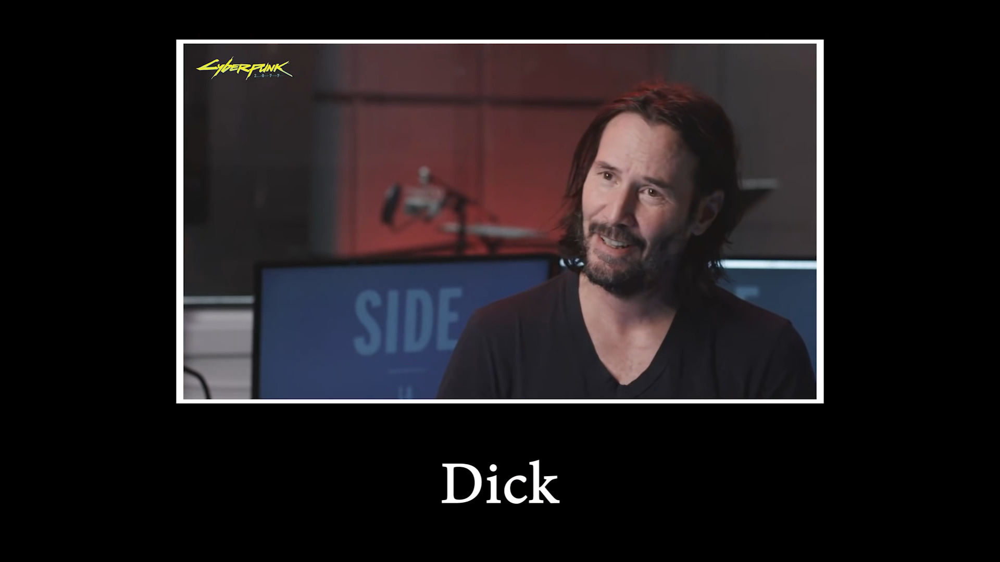
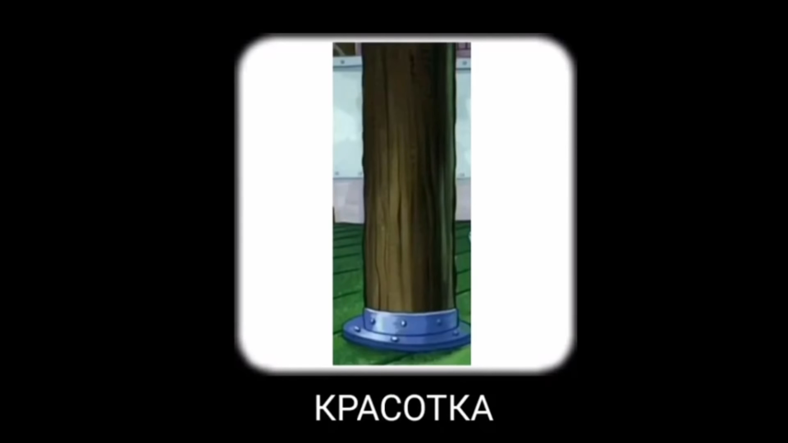

# Demotivator

Зачехляйте фотошопы, теперь что бы создать смешную картинку в стеле мем поджанре демотиватор не нужно вручную рисовать шаблон и писать текст.

Сие продвинутое программное обеспечение заставит Ваш компьютер рисовать шаблоны демотиваторов за Вас (а то чё он под столом пылится).

## Использование

    demotivate capybara.jpg 'Ха-ха, да. Карбюратор' demotivator.jpg
    demotivate capybara.jpg 'Ха-ха, да. Карбюратор' demotivator.jpg --motivate

Результатом исполнения является изображение `demotivator.jpg` следующего вида:



За предоставленную [капибару](https://unsplash.com/photos/yObnHvuwkiY) спасибо [Dušan veverkolog](https://unsplash.com/@veverkolog).

## Примеры

С данной библиотекой Вы сможете сотворить изображения, достойные данных шедевров современного мемостроения (источник доступен по клику на картинку):

[](https://youtu.be/ntXMHf-Ydy8?t=1665)

[](https://youtu.be/p1i06QhmraU?t=5)

[](https://youtu.be/p1i06QhmraU?t=8)

[](https://youtu.be/RxqQYeRosWY?t=335)

## API

### **demotivate**(_image, font, caption, background='#000', foreground='#fff'_)

Добавляет стандартную рамку и текст на входное изображение.

Аргумент **background** отвечает за цвет фона, а **foreground** за цвет рамки и текста.

Размеры текста и рамки высчитываются из размеров изображения.

```python
from demotivator import demotivate

demotivate('capybara.jpg', 'font.ttf', 'Ха-ха, да. Карбюратор')
```

В качестве изображение так же можно передать **ссылку** на изображение.

```python
from demotivator import demotivate

url = 'https://images.unsplash.com/photo-1557431177-36141475c676'
demotivate(url, 'font.ttf', 'Ха-ха, да. Карбюратор')
```

### _class_ **Demotivator**(_font, border, margin, padding, background, foreground_)

Класс для создания шаблонов демотиваторов.

_Border_, _margin_ и _padding_ задаются в виде объектов класса **ImageIndentation**.

```python
from PIL import ImageFont
from demotivator import Demotivator
from demotivator.indent import ImageIndentation

font = ImageFont.truetype('font.ttf')

border = ImageIndentation.css_like(3)
padding = ImageIndentation.css_like(8)
margin = ImageIndentation.css_like(25, 25, 80)

demotivator = Demotivator(font, border, margin, padding, '#000', '#fff')
```

#### Demotivator.**demotivate**(_image, caption_)

Создаёт демотиватор из изображения и надписи по шаблону.

```python
from PIL import Image

image = Image.open('capybara.jpg')
demotivator.demotivate(image, 'Ха-ха. Карбюратор')
```

Процесс генерации рамки состоит из следующих частей:

1. К исходному изображению добавляется _padding_ (внутренний отступ)
1. Таким же отступом рисуется рамка _border_
1. Добавляется _margin_ (внешний отступ)
1. Рисуется текст ровно в центре от _margin.bottom_ (нижнего внешнего отступа)

## _class_ indent.**ImageIndentation**(_left, top, right, bottom_)

Класс предназначен для работы с отступами в пикселях.

### ImageIndentation.**expand**(_image, color='#000'_)

Отрисовать изображение с отступами. Новые границы красятся в заданный _color_.

```python
from PIL import Image
from demotivator.indent import ImageIndentation

indent = ImageIndentation(25, 10, 25, 100)
image = Image.open('capybara.jpg')

expanded = indent.expand(image)
```

### ImageIndentation.**css_like**(_\*values_)

Способ быстрой инициализации класса с помощью [синтаксиса css отступов](http://htmlbook.ru/css/padding).

| Число значений | Результат                                                                                                                |
| -------------- | ------------------------------------------------------------------------------------------------------------------------ |
| 1              | Поля будут установлены одновременно от каждого края элемента                                                             |
| 2              | Первое значение устанавливает поля от верхнего и нижнего края, второе — от левого и правого                              |
| 3              | Первое значение задает поле от верхнего края, второе — одновременно от левого и правого края, а третье — от нижнего края |
| 4              | Поочередно устанавливается поля от верхнего, правого, нижнего и левого края                                              |

```python
from demotivator.indent import ImageIndentation

ImageIndentation.css_like(10)
ImageIndentation.css_like(25, 50)
ImageIndentation.css_like(10, 25, 50)
ImageIndentation.css_like(100, 25, 25, 50)
```
