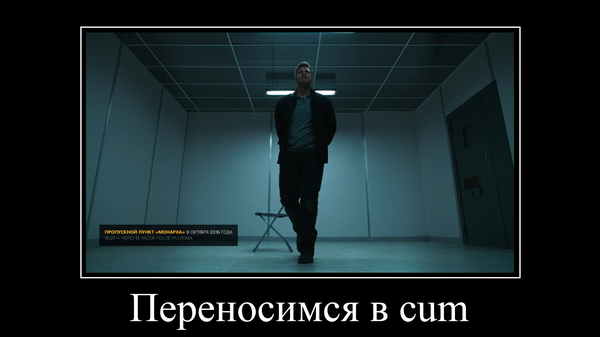
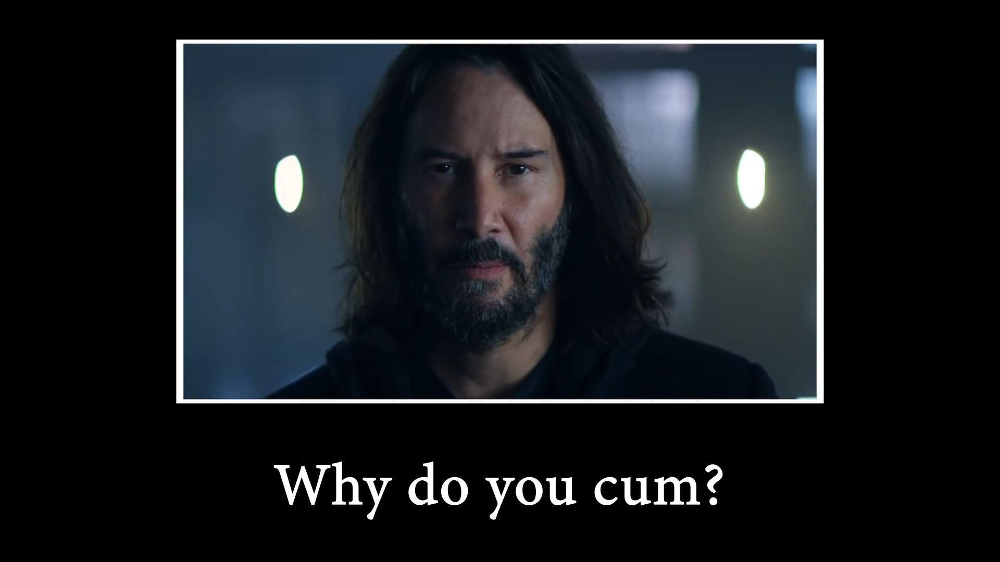

# Demotivator

Зачехляйте фотошопы, теперь что бы создать смешную картинку в стеле мем поджанре демотиватор не нужно вручную рисовать шаблон и писать текст.

Сие продвинутое программное обеспечение заставит Ваш компьютер рисовать шаблоны демотиваторов за Вас (а то чё он под столом пылится).

## Использование

    demotivate capybara.jpg 'Ха-ха, да. Карбюратор' demotivator.jpg
    demotivate capybara.jpg 'Ха-ха, да. Карбюратор' demotivator.jpg --motivate

За предоставленную [капибару](https://unsplash.com/photos/yObnHvuwkiY) спасибо [Dušan veverkolog](https://unsplash.com/@veverkolog).

## Примеры

С данной библиотекой Вы сможете сотворить изображения, достойные данных шедевров современного мемостроения (источник доступен по клику на картинку):

[](https://youtu.be/ntXMHf-Ydy8?t=1665)

[](https://youtu.be/p1i06QhmraU?t=5)

[](https://youtu.be/p1i06QhmraU?t=8)

[](https://youtu.be/RxqQYeRosWY?t=335)

## API

### **demotivate**(_image, font, caption, background='#000', foreground='#fff'_)

Добавляет стандартную рамку и текст на входное изображение.

Аргумент **background** отвечает за цвет фона, а **foreground** за цвет рамки и текста.

Размеры текста и рамки высчитываются из размеров изображения.

```python
from demotivator import demotivate

demotivate('capybara.jpg', 'font.ttf', 'Ха-ха, да. Карбюратор')
```

В качестве изображение так же можно передать **ссылку** на изображение.

```python
from demotivator import demotivate

url = 'https://images.unsplash.com/photo-1557431177-36141475c676'
demotivate(url, 'font.ttf', 'Ха-ха, да. Карбюратор')
```
